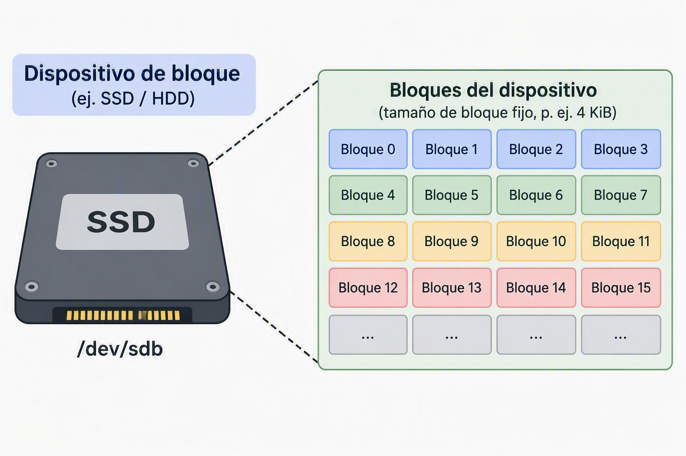

# 2. Almacenamiento en bloques

## 2.1. Introducción al almacenamiento en bloques

El almacenamiento en bloques es uno de los **modelos fundamentales sobre los que se construyen la mayoría de los sistemas informáticos modernos**. Aunque los usuarios suelen interactuar con archivos y carpetas, internamente los sistemas operativos trabajan con estructuras mucho más básicas denominadas bloques.

Este modelo de almacenamiento ha sido durante décadas la base de discos duros, unidades SSD, cabinas SAN y sistemas de virtualización. Actualmente continúa desempeñando un papel esencial en las infraestructuras cloud, especialmente en aquellas cargas de trabajo que requieren alto rendimiento, baja latencia y acceso directo a los datos.

Dentro de los entornos de computación en la nube, el almacenamiento en bloques constituye uno de los **principales mecanismos utilizados para proporcionar almacenamiento persistente a servidores virtuales, bases de datos y aplicaciones empresariales**. El currículo del Curso de Especialización incluye específicamente la administración de almacenamiento por bloques dentro de los contenidos relativos al almacenamiento cloud.

---

## 2.2. Qué es un bloque

Un bloque es la **unidad mínima de almacenamiento con la que trabaja un dispositivo de almacenamiento**.

Puede entenderse como una pequeña porción de espacio identificada mediante una dirección única. Cada bloque contiene una cantidad fija de datos, habitualmente de varios kilobytes, y puede ser leído o escrito de forma independiente.

A diferencia de un sistema de archivos, los bloques no contienen información sobre nombres de archivos, carpetas o permisos. El dispositivo únicamente almacena bloques numerados y permite acceder a ellos mediante su dirección.

Por ejemplo, cuando un documento se guarda en un disco, el sistema operativo divide su contenido en múltiples bloques. Cada uno de ellos se almacena en una ubicación determinada y posteriormente el sistema de archivos se encarga de mantener la relación entre esos bloques y el nombre visible para el usuario.

Esta separación entre almacenamiento físico y organización lógica constituye una de las principales características del almacenamiento en bloques.

---

## 2.3. Funcionamiento del almacenamiento en bloques

El funcionamiento de este modelo se basa en una **división del espacio de almacenamiento en múltiples bloques independientes**.

Cuando una aplicación necesita guardar información, el sistema operativo solicita al dispositivo de almacenamiento una serie de bloques libres. Los datos son **fragmentados y distribuidos entre esos bloques**, registrando posteriormente dónde se encuentra cada fragmento.

Cuando se necesita recuperar la información, el proceso se realiza en sentido inverso. El sistema operativo localiza los bloques correspondientes y reconstruye el contenido original.

Desde el punto de vista del dispositivo de almacenamiento, únicamente existen **bloques numerados**. No conoce el significado de la información almacenada ni sabe si contiene un documento, una base de datos o una imagen del sistema operativo.

Esta simplicidad permite alcanzar elevados niveles de rendimiento, ya que las operaciones de lectura y escritura se realizan directamente sobre bloques concretos sin necesidad de mecanismos adicionales de interpretación.

Además, este modelo resulta especialmente adecuado para sistemas que requieren una **gran cantidad de operaciones de entrada y salida (IOPS) o una baja latencia**, características habituales en entornos empresariales y cloud. El rendimiento constituye uno de los criterios fundamentales empleados para seleccionar soluciones de almacenamiento en plataformas de nube.

---

## 2.4. Presentación al sistema operativo

Una de las características más importantes del almacenamiento en bloques es la forma en que se presenta al sistema operativo.

Cuando un **volumen de almacenamiento en bloques** se conecta a un servidor, este lo percibe como si fuese un disco físico local. Desde **la perspectiva del sistema operativo no existe una diferencia significativa entre un disco conectado mediante SATA o NVMe** y un volumen de almacenamiento en bloques proporcionado por un proveedor cloud.

Una vez detectado el dispositivo, el administrador debe realizar las mismas tareas que efectuaría con cualquier disco nuevo:

1. Crear particiones si es necesario.
2. Formatear el volumen con un sistema de archivos.
3. Montarlo en el sistema operativo.
4. Asignarlo a aplicaciones o servicios concretos.

Este comportamiento **convierte al almacenamiento en bloques en una solución extremadamente flexible**, ya que permite utilizar cualquier sistema de archivos compatible con el sistema operativo y adaptar el almacenamiento a las necesidades de cada aplicación.

En los entornos cloud modernos, los volúmenes de almacenamiento en bloques **suelen conectarse de forma dinámica a instancias virtuales de computación**, permitiendo ampliar la capacidad disponible sin modificar la arquitectura general del sistema. El despliegue y administración de almacenamiento asociado a recursos de computación constituye una de las competencias incluidas en el curso de especialización.

---

## 2.5. Casos de uso del almacenamiento en bloques

### 2.5.1. Sistemas operativos

Uno de los usos más habituales del almacenamiento en bloques consiste en alojar sistemas operativos.

Los archivos que forman Windows, Linux u otros sistemas necesitan un acceso rápido y continuo al almacenamiento. Durante el arranque del sistema se realizan miles de operaciones de lectura que requieren una latencia reducida.

Por este motivo, **los discos donde reside el sistema operativo suelen utilizar almacenamiento en bloques**. Este modelo proporciona el rendimiento necesario para ejecutar procesos, cargar bibliotecas, gestionar memoria virtual y mantener la estabilidad general del sistema.

En entornos cloud, cada máquina virtual suele disponer de un volumen de almacenamiento en bloques donde se encuentra instalado el sistema operativo de la instancia.

---

### 2.5.2. Bases de datos

Las bases de datos constituyen una de las cargas de trabajo más exigentes desde el punto de vista del almacenamiento.

Los **sistemas gestores de bases de datos realizan continuamente operaciones de lectura, escritura, actualización e indexación. Muchas de estas operaciones implican pequeñas cantidades de datos, pero deben ejecutarse con una gran velocidad y precisión.**

**El almacenamiento en bloques resulta especialmente adecuado para este escenario** porque permite un acceso directo a los datos con baja latencia y un elevado número de IOPS.

Plataformas como Oracle Database, Microsoft SQL Server, PostgreSQL o MySQL suelen apoyarse en sistemas de almacenamiento en bloques para garantizar un rendimiento adecuado en aplicaciones empresariales críticas.

El currículo oficial de este curso destaca expresamente la necesidad de seleccionar soluciones de almacenamiento atendiendo a criterios de rendimiento, durabilidad y fiabilidad, especialmente en sistemas de bases de datos.

---

### 2.5.3. Máquinas virtuales

Otro caso de uso fundamental es el almacenamiento utilizado por las máquinas virtuales.

Una máquina virtual se comporta como un ordenador completo, incluyendo sistema operativo, aplicaciones, configuraciones y datos propios. Todo ello suele almacenarse en ficheros que representan discos virtuales.

Para que estos discos virtuales funcionen correctamente, necesitan una infraestructura de almacenamiento capaz de simular el comportamiento de discos físicos. **El almacenamiento en bloques proporciona precisamente esta funcionalidad**.

Gracias a ello, plataformas de virtualización como VMware, Hyper-V, KVM o los servicios cloud de infraestructura pueden crear y administrar máquinas virtuales con elevados niveles de rendimiento.

El uso de recursos de almacenamiento asociados a instancias de computación forma parte de los contenidos relacionados con la administración de recursos cloud y computación en la nube.

---

## 2.6. Ventajas e inconvenientes

### Ventajas

El almacenamiento en bloques ofrece importantes beneficios que explican su amplia utilización en infraestructuras modernas.

En primer lugar, proporciona un **elevado rendimiento** gracias al acceso directo a los datos. Esta característica lo convierte en una opción ideal para aplicaciones críticas que requieren **rapidez y baja latencia**.

Otra ventaja relevante es su **flexibilidad**. Al presentarse como un disco convencional, puede utilizarse con cualquier sistema operativo y prácticamente con cualquier sistema de archivos.

Se **integra fácilmente con tecnologías de virtualización, bases de datos y sistemas empresariales**.

Por último, suele ofrecer una **gestión muy precisa de los recursos**, permitiendo definir características específicas de capacidad, rendimiento y disponibilidad.

---

### Inconvenientes

A pesar de sus ventajas, el almacenamiento en bloques también presenta ciertas limitaciones.

Su principal inconveniente es que no proporciona una estructura de archivos propia. El administrador debe crear sistemas de archivos y gestionar manualmente la organización de la información.

Además, normalmente está **diseñado para ser utilizado por un único sistema a la vez**, lo que dificulta el acceso compartido entre múltiples servidores sin mecanismos adicionales.

Otra limitación es que su **coste suele ser superior al de soluciones orientadas a almacenamiento masivo de datos**, especialmente cuando se requieren altos niveles de rendimiento.

Por esta razón, no suele utilizarse para almacenar grandes cantidades de archivos estáticos, copias de seguridad o contenido multimedia, donde otros modelos resultan más eficientes económicamente.

---

## 2.7. Equivalencia en AWS: Amazon EBS

### 2.7.1. Amazon Elastic Block Store (EBS)

Dentro del ecosistema AWS, el principal servicio de almacenamiento en bloques es **Amazon Elastic Block Store (Amazon EBS)**.

Amazon EBS proporciona volúmenes persistentes de almacenamiento que pueden conectarse a instancias Amazon EC2 y utilizarse exactamente igual que un disco duro local. El módulo de almacenamiento y bases de datos del curso utiliza específicamente Amazon EBS como uno de los servicios fundamentales para la administración de almacenamiento cloud.

Los volúmenes EBS están diseñados para ofrecer:

- Baja latencia.
- Alto rendimiento.
- Persistencia de los datos.
- Integración con copias de seguridad mediante *snapshots*.
- Escalabilidad en capacidad y rendimiento.

Cuando una instancia EC2 se inicia, puede utilizar uno o varios volúmenes EBS para alojar el sistema operativo, las aplicaciones o las bases de datos. Esta relación entre computación y almacenamiento es uno de los aspectos fundamentales del diseño de infraestructuras cloud modernas.

Además, Amazon EBS permite crear instantáneas (*snapshots*) para proteger la información y facilitar procesos de recuperación ante fallos. La administración de Amazon EBS y la gestión de *snapshots* aparecen recogidas entre los laboratorios principales del módulo de almacenamiento del curso.

En las arquitecturas AWS, Amazon EBS representa el equivalente natural al almacenamiento en bloques tradicional utilizado en servidores físicos, cabinas SAN o plataformas de virtualización, proporcionando una solución flexible y de alto rendimiento para entornos empresariales en la nube.
