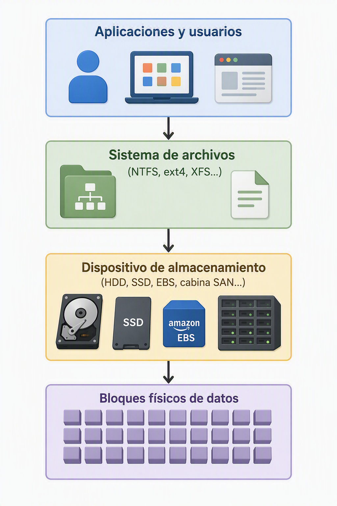
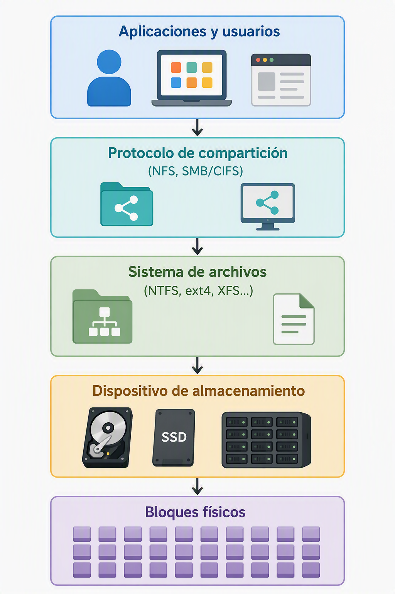
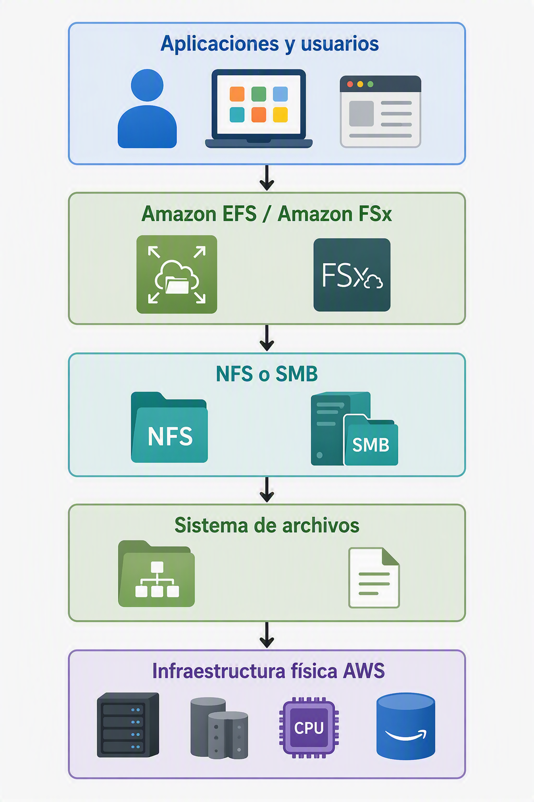
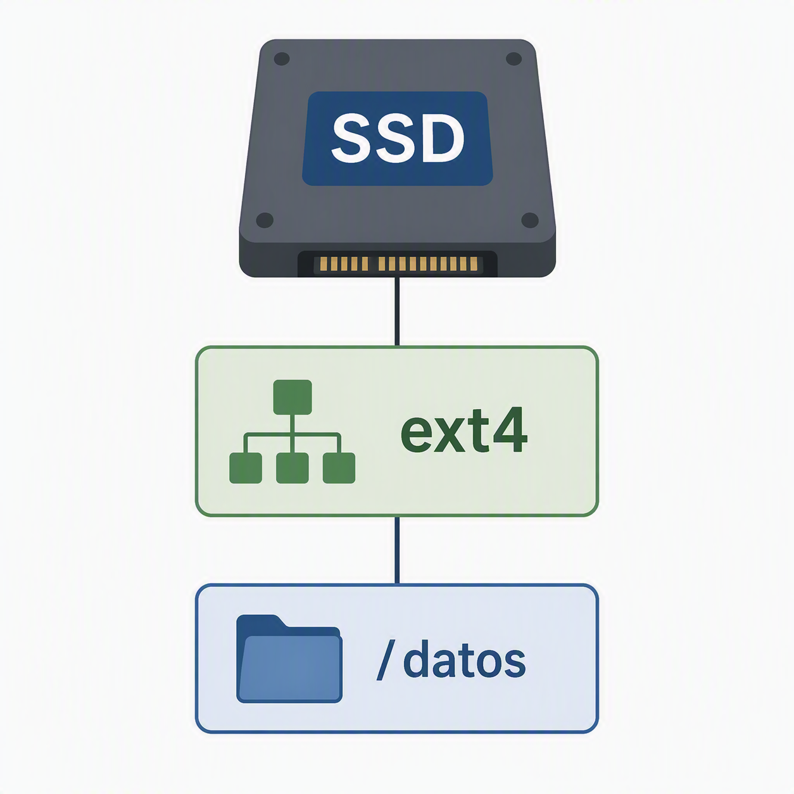
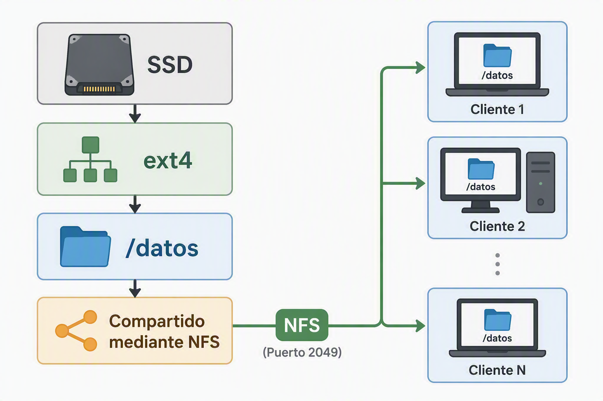

# 3. Almacenamiento de archivos

## 3.1. Introducción al almacenamiento de archivos

Hasta ahora se ha estudiado el almacenamiento en bloques, donde la información se organiza en bloques de datos accesibles directamente por el sistema operativo. Sin embargo, los usuarios no trabajan habitualmente con bloques, sino con archivos y carpetas.

Para hacer posible esta organización aparece una capa adicional denominada **sistema de archivos**, responsable de transformar un conjunto de bloques físicos en una estructura comprensible y manejable.

Comprender el almacenamiento de archivos implica entender varias capas tecnológicas que se construyen unas sobre otras. Esta visión es especialmente importante en entornos cloud, donde conceptos tradicionales como discos, sistemas de archivos y recursos compartidos siguen existiendo, aunque ocultos tras servicios gestionados.

## 3.2. De los bloques a los archivos: construcción por capas

Uno de los errores más habituales al estudiar almacenamiento consiste en considerar que los archivos existen directamente sobre el hardware. En realidad, existen varias capas intermedias.

La relación puede representarse de la siguiente forma:

Si además los archivos se comparten a través de la red, aparece una nueva capa:

Si trasladamos esta estructura a la nube de AWS tendríamos algo similar a esto:

## 3.3. Qué es un sistema de archivos

Un sistema de archivos es el **conjunto de estructuras y mecanismos que permiten organizar, almacenar, localizar y recuperar información** dentro de un dispositivo de almacenamiento.

Cuando un disco se encuentra vacío, **únicamente contiene bloques de datos**. El sistema de archivos es el encargado de decidir qué bloques pertenecen a cada archivo, dónde comienza y termina cada uno y qué información adicional debe almacenarse para gestionarlos correctamente.

Gracias a él, el sistema operativo puede representar la información mediante **archivos y carpetas** en lugar de trabajar directamente con bloques físicos.

Entre sus principales responsabilidades se encuentran:

- Organizar archivos y directorios.
- Gestionar el espacio libre disponible.
- Asignar bloques a los archivos.
- Mantener información sobre propietarios y permisos.
- Gestionar fechas de creación y modificación.
- Facilitar la recuperación de los datos.

Sin un sistema de archivos, todos los datos almacenados serían simplemente una secuencia de bloques sin estructura ni significado aparente.

---

## 3.4. Sistemas de archivos más habituales

A lo largo de la evolución de la informática han aparecido múltiples sistemas de archivos diseñados para diferentes sistemas operativos y necesidades.

### FAT y FAT32

Fueron durante muchos años los sistemas de archivos predominantes en entornos Microsoft.

Su simplicidad facilitó una amplia compatibilidad entre distintos dispositivos, aunque presentan limitaciones importantes en tamaño máximo de archivos y capacidades de seguridad.

Actualmente siguen utilizándose en memorias USB y dispositivos embebidos.

---

### NTFS

NTFS (*New Technology File System*) es el sistema de archivos tradicional de los sistemas Windows modernos.

Introduce características avanzadas como:

- Permisos de seguridad.
- Compresión.
- Cifrado.
- Cuotas de almacenamiento.
- Recuperación ante errores.

Durante años ha sido el estándar de facto en servidores y estaciones de trabajo Windows.

---

### ext4

ext4 es uno de los sistemas de archivos más utilizados en Linux.

Destaca por su estabilidad, rendimiento y fiabilidad. Actualmente constituye el sistema de archivos predeterminado en numerosas distribuciones Linux.

Muchas infraestructuras cloud basadas en Linux utilizan ext4 como capa de almacenamiento local.

---

### BTRFS

**Btrfs** es un sistema de archivos moderno desarrollado inicialmente por Oracle para Linux. Su objetivo era ofrecer funcionalidades avanzadas que tradicionalmente requerían herramientas externas o incluso sistemas completos de almacenamiento.

A diferencia de sistemas más clásicos como ext4, Btrfs no se limita a organizar archivos y directorios, sino que incorpora mecanismos avanzados de gestión de datos, integridad y administración del almacenamiento.

Entre las características más destacadas se encuentran:

- **Snapshots nativos**, capaces de capturar el estado completo de un sistema de archivos en un instante concreto.
- **Copy-on-Write (CoW)**, donde los datos modificados se escriben en nuevas ubicaciones antes de reemplazar los originales.
- **Subvolúmenes**, que permiten dividir lógicamente el sistema de archivos sin necesidad de crear particiones adicionales.
- **Compresión transparente**, reduciendo el espacio ocupado en disco.
- **Comprobación de integridad mediante checksums**, detectando corrupciones silenciosas de datos.
- **RAID integrado**, sin necesidad de herramientas externas como mdadm.
- **Redimensionado dinámico**, tanto ampliando como reduciendo sistemas de archivos en caliente.

---

### XFS y ZFS

Son sistemas de archivos orientados a entornos empresariales y grandes volúmenes de datos.

Incorporan funcionalidades avanzadas relacionadas con:

- Escalabilidad.
- Integridad de datos.
- Snapshots.
- Rendimiento en sistemas de almacenamiento masivo.

Su utilización es habitual en centros de datos y plataformas de almacenamiento de altas prestaciones.

## 3.5. Almacenamiento de archivos y almacenamiento de archivos en red

En este punto es importante diferenciar dos conceptos que suelen confundirse.

### Almacenamiento de archivos

Se refiere al modelo lógico mediante el cual la información se organiza en archivos y directorios gracias a un sistema de archivos.

En este caso existe almacenamiento de archivos, pero **únicamente es accesible desde el propio equipo**.

### Almacenamiento de archivos en red

Se produce cuando un sistema de archivos se comparte para que varios equipos puedan acceder simultáneamente a él a través de una red.

Ahora **varios clientes** pueden utilizar el mismo conjunto de archivos.

Esta modalidad es la base de gran parte de los sistemas NAS tradicionales y de numerosos servicios cloud modernos.

---

## 3.6. Protocolos de acceso al almacenamiento de archivos en red

Para que múltiples sistemas puedan acceder a un mismo almacenamiento de archivos es necesario utilizar protocolos de comunicación especializados.

Estos protocolos permiten que un servidor de archivos comparta información a través de la red y que distintos clientes puedan acceder a ella como si se encontrase almacenada localmente.

Los dos protocolos más extendidos son **NFS y SMB/CIFS**.

---

### 3.6.1. NFS (Network File System)

NFS es un protocolo desarrollado originalmente para sistemas Unix y posteriormente adoptado por gran parte de los entornos Linux.

Su objetivo es permitir que un sistema remoto acceda a un **directorio compartido de forma transparente**. Desde el punto de vista del cliente, el recurso remoto puede montarse como si fuese una unidad local integrada en el propio sistema operativo.

Este protocolo se caracteriza por su simplicidad, eficiencia y amplia integración con **sistemas Linux y Unix**.

A lo largo de los años, NFS ha evolucionado incorporando mejoras relacionadas con el rendimiento, la autenticación y la seguridad, convirtiéndose en una de las soluciones más utilizadas en centros de datos y plataformas cloud.

Actualmente es frecuente encontrar NFS en entornos como:

- Infraestructuras Linux empresariales.
- Sistemas HPC (*High Performance Computing*).
- Entornos de virtualización.
- Almacenamiento compartido para aplicaciones corporativas.
- Servicios cloud de almacenamiento de archivos.

Su uso resulta especialmente habitual cuando varios servidores Linux necesitan acceder simultáneamente a la misma información.

---

### 3.6.2. SMB/CIFS

SMB (*Server Message Block*) es el protocolo **tradicionalmente asociado a los sistemas Microsoft Windows**.

Su objetivo es proporcionar acceso compartido a archivos, impresoras y otros recursos de red mediante un modelo centralizado de gestión.

Durante muchos años la implementación CIFS (*Common Internet File System*) constituyó la versión más extendida de SMB. Actualmente las versiones modernas de SMB incorporan importantes mejoras en rendimiento, cifrado, autenticación y disponibilidad.

La principal ventaja de SMB radica en su **integración con entornos corporativos basados en Windows y servicios de directorio como Active Directory**.

Cuando un usuario accede a una carpeta compartida en una organización, generalmente está utilizando SMB para establecer la comunicación con el servidor de archivos.

Hoy en día también existen implementaciones compatibles con Linux, macOS y otros sistemas operativos, permitiendo la interoperabilidad entre diferentes plataformas tecnológicas.

---

## 3.7. Compartición de ficheros

La compartición de ficheros consiste en permitir que varios usuarios o sistemas **accedan a una misma información almacenada de forma centralizada**.

Este modelo elimina la necesidad de mantener múltiples copias de los mismos documentos en diferentes equipos, favoreciendo la colaboración y simplificando la administración de los datos.

Cuando un **servidor de archivos** comparte un recurso, los usuarios pueden acceder a él a través de la red utilizando los protocolos adecuados y las credenciales autorizadas.

La compartición de ficheros suele complementarse con mecanismos de control de acceso que permiten definir:

- Quién puede visualizar la información.
- Quién puede modificarla.
- Quién puede eliminarla.
- Quién puede crear nuevos archivos.

En los entornos corporativos modernos, estas políticas suelen estar integradas con directorios centralizados de usuarios y grupos.

La compartición centralizada facilita además la realización de copias de seguridad, la aplicación de políticas de seguridad y la implantación de mecanismos de recuperación ante desastres.

En los servicios cloud actuales, el almacenamiento de archivos mantiene este mismo enfoque, pero apoyándose en infraestructuras distribuidas y administradas por los proveedores de nube.

---

## 3.8. Casos de uso del almacenamiento de archivos

### 3.8.1. Directorios corporativos

Uno de los usos más tradicionales del almacenamiento de archivos consiste en la creación de **directorios corporativos compartidos**.

Estos espacios permiten almacenar documentación común de la organización, como procedimientos internos, plantillas, documentación técnica o información administrativa.

Al centralizar la información en un único repositorio se simplifica la gestión documental y se garantiza que todos los usuarios trabajen sobre la misma versión de cada documento.

Este modelo sigue siendo **ampliamente utilizado** tanto en infraestructuras locales como en entornos cloud empresariales.

---

### 3.8.2. Aplicaciones compartidas

Muchas aplicaciones requieren acceder simultáneamente a los mismos archivos desde distintos servidores o estaciones de trabajo.

En estos casos, el almacenamiento de archivos proporciona un repositorio común que puede ser utilizado por múltiples sistemas de manera concurrente.

Algunos ejemplos habituales son:

- Aplicaciones web distribuidas.
- Plataformas colaborativas.
- Sistemas documentales.
- Aplicaciones empresariales con múltiples servidores.
- Entornos de desarrollo compartidos.

La capacidad de acceso simultáneo constituye una de las principales razones por las que el almacenamiento de archivos continúa siendo una tecnología esencial en infraestructuras modernas.

---

### 3.8.3. Home Directories

Los *home directories* son directorios personales asignados a usuarios concretos.

En lugar de almacenar la información en cada equipo individual, los datos personales del usuario residen en un servidor centralizado accesible desde cualquier dispositivo autorizado.

Este modelo ofrece numerosas ventajas:

- Centralización de la información.
- Simplificación de copias de seguridad.
- Movilidad entre equipos.
- Administración centralizada.
- Aplicación uniforme de políticas de seguridad.

Durante años esta estrategia ha sido ampliamente utilizada en universidades, administraciones públicas y grandes organizaciones empresariales.

En la actualidad, muchos servicios cloud implementan conceptos similares mediante sistemas de almacenamiento de archivos administrados.

---

## 3.9. Ventajas e inconvenientes

### Ventajas

El almacenamiento de archivos se ha mantenido vigente durante décadas debido a su **facilidad de uso** y comprensión.

Su principal ventaja es que ofrece una **estructura intuitiva basada en carpetas y archivos**, permitiendo a los usuarios localizar fácilmente la información.

Además, facilita el acceso compartido entre múltiples usuarios y sistemas sin necesidad de configuraciones complejas.

Otra ventaja significativa es la **posibilidad de aplicar permisos y controles de seguridad a diferentes niveles de la jerarquía de directorios**.

Asimismo, resulta compatible con una enorme cantidad de aplicaciones y sistemas operativos, convirtiéndose en una solución muy versátil para entornos corporativos.

---

### Inconvenientes

A medida que aumenta el volumen de información, la estructura jerárquica puede volverse compleja y difícil de administrar.

Por otra parte, los sistemas de archivos tradicionales **presentan limitaciones cuando se requieren escalas masivas de almacenamiento** similares a las utilizadas por grandes plataformas cloud.

También **pueden aparecer problemas de rendimiento cuando numerosos usuarios acceden simultáneamente** a los mismos recursos compartidos.

Además, la expansión de estos sistemas **suele requerir mecanismos adicionales de administración y balanceo de carga** para evitar cuellos de botella.

Por estas razones, para ciertos escenarios de grandes volúmenes de datos o aplicaciones distribuidas se utilizan con frecuencia soluciones de almacenamiento de objetos.

---

## 3.10. Equivalencia en AWS

Los servicios de almacenamiento de archivos en AWS permiten mantener el mismo modelo tradicional de directorios, carpetas y archivos, pero apoyándose en infraestructuras completamente gestionadas y altamente escalables.

En este módulo, se contempla específicamente el estudio y administración de **Amazon EFS** como equivalente cloud del almacenamiento de archivos tradicional. 

---

### 3.10.1. Amazon Elastic File System (EFS)

**Amazon EFS (Elastic File System)** es el servicio de almacenamiento de archivos administrado de AWS diseñado principalmente para entornos Linux.

Proporciona un sistema de archivos compartido accesible simultáneamente desde múltiples instancias de Amazon EC2 utilizando el protocolo NFS.

Desde la perspectiva de los servidores, el sistema se comporta exactamente igual que un sistema de archivos convencional, permitiendo almacenar aplicaciones, datos compartidos y directorios de usuario.

Entre sus características más destacadas se encuentran:

- Escalado automático de capacidad.
- Alta disponibilidad.
- Integración nativa con AWS.
- Acceso concurrente desde múltiples servidores.
- Administración simplificada.

Gracias a estas capacidades, Amazon EFS resulta especialmente adecuado para aplicaciones web distribuidas, sistemas empresariales compartidos y entornos de desarrollo colaborativo. La administración de **Amazon EFS** aparece recogida entre los laboratorios principales del módulo de almacenamiento.

---

### 3.10.2. Amazon FSx

**Amazon FSx** es una familia de servicios administrados que proporciona sistemas de archivos compatibles con diferentes tecnologías empresariales.

A diferencia de Amazon EFS, que está orientado específicamente a entornos NFS y Linux, FSx ofrece implementaciones especializadas para distintos escenarios tecnológicos.

AWS proporciona diferentes variantes adaptadas a necesidades concretas:

- FSx for Windows File Server.
- FSx for NetApp ONTAP.
- FSx for OpenZFS.
- FSx for Lustre.

Estas soluciones permiten migrar a la nube sistemas de archivos empresariales tradicionales manteniendo compatibilidad con aplicaciones y flujos de trabajo ya existentes.

Su utilización resulta especialmente interesante en organizaciones que necesitan integrar infraestructuras locales y cloud sin modificar significativamente su arquitectura de almacenamiento.
