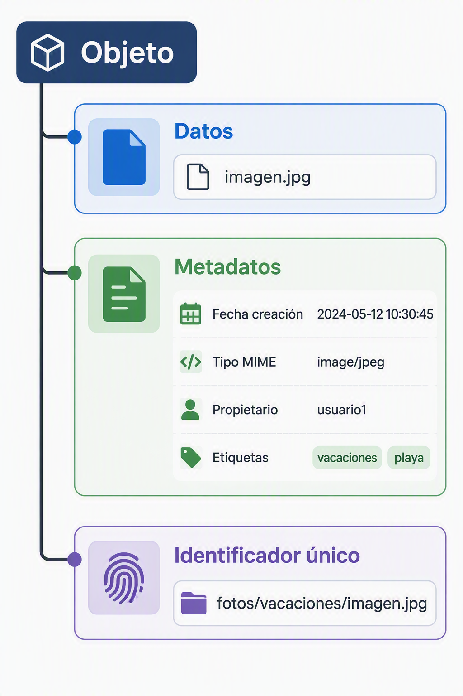
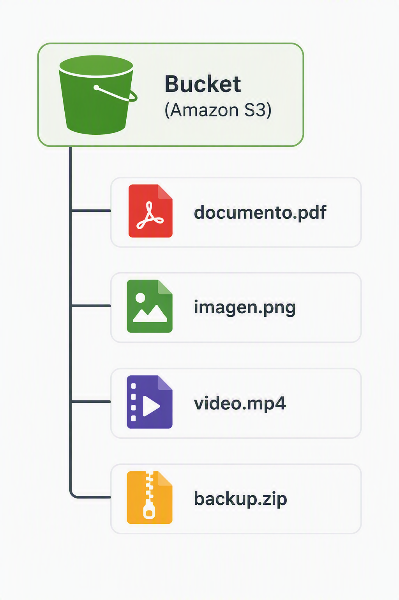

# 4. Almacenamiento de objetos

## 4.1 Concepto de objeto

El almacenamiento de objetos constituye **uno de los pilares fundamentales** de la computación en la nube moderna. A medida que las organizaciones comenzaron a generar cantidades masivas de información en forma de documentos, imágenes, vídeos, registros de actividad y copias de seguridad, los sistemas tradicionales de almacenamiento basados en ficheros o bloques empezaron a mostrar limitaciones en cuanto a escalabilidad y gestión.

Para solucionar este problema surgió el modelo de almacenamiento de objetos. En este enfoque, cada elemento almacenado se trata como una entidad independiente denominada **objeto**. Un objeto no contiene únicamente los datos del archivo, sino también **información adicional** que permite identificarlo, clasificarlo y administrarlo dentro de la plataforma. Este modelo **hace posible almacenar cantidades prácticamente ilimitadas de información distribuidas entre múltiples servidores y centros de datos**. La administración de este tipo de almacenamiento forma parte de los contenidos que trataremos en este módulo.

Desde el punto de vista conceptual, una fotografía, un vídeo, un documento PDF o una copia de seguridad completa de un servidor pueden considerarse objetos. Todos ellos se almacenan de la misma manera, independientemente de su contenido o formato.

A diferencia de los sistemas de archivos tradicionales, donde la ubicación física de los datos y la estructura de directorios tienen una gran importancia, **en el almacenamiento de objetos lo relevante es la identificación única del objeto** y la capacidad de recuperarlo cuando sea necesario. Gracias a esta filosofía es posible gestionar enormes repositorios de información con una complejidad muy reducida para los usuarios y administradores.

---

## 4.2 Metadatos

Uno de los elementos más importantes asociados a un objeto son los **metadatos**. Se denomina metadato a cualquier información adicional utilizada para describir o clasificar un dato almacenado.

Cuando un archivo se guarda dentro de una plataforma de almacenamiento de objetos, no solamente se conserva su **contenido**. También se almacenan multitud de características relacionadas con él, como la fecha de creación, el tamaño, el propietario, el tipo de contenido o cualquier información personalizada que la organización considere útil.

Ejemplo de metadados:

| Metadato          | Ejemplo                |
| ----------------- | ---------------------- |
| Nombre            | foto.jpg               |
| Tamaño            | 5 MB                   |
| Fecha creación    | 15/09/2026             |
| Tipo de contenido | image/jpeg             |
| Propietario       | Departamento Marketing |
| Etiquetas         | Proyecto-Web           |

Los metadatos permiten que los objetos puedan **localizarse, clasificarse y administrarse de forma eficiente**. En un entorno empresarial donde pueden existir millones de documentos almacenados, resulta **inviable depender exclusivamente del nombre de los archivos para encontrarlos**. Gracias a los metadatos es posible buscar información según criterios muy variados, aplicar políticas automáticas de gestión o restringir el acceso a determinados conjuntos de datos.

En los entornos cloud modernos, los metadatos también desempeñan un papel fundamental en tareas como la monitorización, la auditoría, el gobierno del dato y la automatización de procesos. El currículo oficial contempla expresamente el uso de etiquetas y metadatos como parte de la administración de sistemas de almacenamiento de objetos.

Por ejemplo, una imagen utilizada por el departamento de marketing podría almacenar información sobre la campaña publicitaria a la que pertenece, el idioma en el que será utilizada o la fecha prevista para su eliminación automática. Toda esta información se almacena como metadatos asociados al objeto.

---

## 4.3 Buckets

Los objetos necesitan un mecanismo que permita organizarlos dentro de la plataforma de almacenamiento. Para ello se utilizan contenedores lógicos denominados **buckets**, también conocidos como depósitos.

Un bucket puede entenderse como una **agrupación de objetos relacionados**. Aunque desde la perspectiva del usuario podría parecer una carpeta tradicional, internamente su funcionamiento es diferente. El bucket **actúa como una unidad administrativa sobre la que se aplican configuraciones de seguridad, cifrado, replicación, monitorización o control de acceso**.

Cuando una organización comienza a utilizar almacenamiento de objetos suele crear distintos buckets para separar la información según su finalidad. Por ejemplo, puede existir un bucket dedicado a copias de seguridad, otro para almacenar imágenes de una aplicación web y un tercero destinado al almacenamiento de documentos corporativos.

La elección de los nombres de los buckets, así como su configuración de seguridad y ciclo de vida, es una de las tareas más importantes dentro de la administración de este tipo de sistemas. En este módulo aprenderemos a definir contenedores o buckets, gestionar sus configuraciones y aplicar políticas de retención y seguridad.

Además de servir como elemento organizativo, los buckets constituyen **el punto de entrada habitual para las aplicaciones y usuarios que necesitan almacenar o recuperar información desde la nube**.

---

## 4.4 Acceso mediante API

Una de las diferencias más importantes entre el almacenamiento de objetos y los sistemas de almacenamiento tradicionales es **la forma en la que se accede a la información**.

Mientras que en un servidor convencional los archivos suelen accederse mediante rutas del sistema operativo, las plataformas de almacenamiento de objetos utilizan normalmente **API** (Application Programming Interface). Estas interfaces permiten que aplicaciones, servicios y usuarios interactúen con el almacenamiento mediante solicitudes realizadas a través de la red.

La mayoría de proveedores cloud implementan APIs basadas en protocolos HTTP y HTTPS. Gracias a ello, cualquier aplicación capaz de realizar peticiones web puede interactuar con el sistema de almacenamiento.

Las operaciones más comunes consisten en subir objetos, descargarlos, eliminarlos o listar el contenido de un bucket. Estas acciones pueden ejecutarse desde aplicaciones web, herramientas de línea de comandos, librerías de programación o plataformas de automatización.

Gracias a este modelo de acceso, el almacenamiento de objetos se integra fácilmente con plataformas de análisis de datos, aplicaciones móviles, sistemas de inteligencia artificial o servicios de automatización empresarial.

---

## 4.5 Escalabilidad masiva

La principal razón por la que el almacenamiento de objetos se ha convertido en el modelo predominante dentro de la nube es su **extraordinaria capacidad de escalado**.

En los sistemas tradicionales el crecimiento suele requerir la incorporación de nuevos discos, servidores o cabinas de almacenamiento. Este proceso implica planificación, adquisición de hardware y tareas de mantenimiento que aumentan la complejidad de la infraestructura.

El almacenamiento de objetos adopta una filosofía completamente diferente. **Los datos se distribuyen automáticamente entre múltiples servidores, zonas de disponibilidad e incluso centros de datos distintos**. Esta distribución es transparente para el usuario, que percibe el sistema como una única plataforma de almacenamiento.

Gracias a este diseño, la capacidad disponible puede crecer desde unos pocos megabytes hasta varios petabytes sin necesidad de modificar la arquitectura de las aplicaciones que utilizan el servicio. La infraestructura subyacente es gestionada por el proveedor cloud, mientras que el usuario únicamente se preocupa por almacenar y recuperar información.

La enorme escalabilidad de este modelo se complementa con mecanismos de replicación automática, alta disponibilidad y tolerancia a fallos. Por este motivo, el almacenamiento de objetos se ha convertido en una solución especialmente adecuada para organizaciones que manejan grandes volúmenes de información o que experimentan crecimientos impredecibles de datos.

---

# 4.6 Casos de uso

## Backups

Las copias de seguridad son uno de los usos más habituales del almacenamiento de objetos. Una copia de seguridad suele requerir grandes cantidades de espacio, un elevado nivel de durabilidad y costes reducidos de almacenamiento.

El modelo de almacenamiento de objetos satisface perfectamente estos requisitos. Los proveedores cloud suelen ofrecer mecanismos de replicación, cifrado y retención automática que permiten **conservar la información durante largos periodos de tiempo con un coste relativamente bajo**.

Por esta razón, muchas organizaciones almacenan en sistemas de objetos las copias de seguridad de servidores, bases de datos, estaciones de trabajo o aplicaciones corporativas. El currículo oficial incluye la planificación de procesos de copia de seguridad, retención y recuperación de datos en entornos cloud.

---

## Data Lakes

Otro uso muy habitual es la construcción de **Data Lakes** o lagos de datos.

Un Data Lake es un **repositorio diseñado para almacenar grandes cantidades de información en su formato original, sin necesidad de transformarla previamente**. Dentro de él pueden convivir documentos, imágenes, registros de actividad, datos procedentes de sensores, hojas de cálculo o bases de datos completas.

El almacenamiento de objetos resulta especialmente adecuado para este escenario debido a su capacidad para gestionar enormes volúmenes de información a bajo coste y con una gran flexibilidad.

Posteriormente, estos datos pueden ser utilizados por herramientas de análisis, inteligencia artificial o sistemas de explotación de información para obtener conocimiento útil para la organización.

---

## Web estática

El almacenamiento de objetos también se puede utilizar para alojar sitios web estáticos.

Una web estática está formada por archivos HTML, hojas de estilo, código JavaScript e imágenes que no requieren procesamiento dinámico en el servidor. En estos casos no es necesario mantener una infraestructura compleja de servidores web.

Los archivos pueden almacenarse directamente dentro de un bucket y ser servidos a los usuarios a través de Internet. Esta solución proporciona un elevado rendimiento, una gran disponibilidad y costes muy reducidos.

Actualmente numerosas páginas corporativas, portales informativos y sitios de documentación utilizan almacenamiento de objetos como plataforma principal de publicación.

---

## Multimedia

El contenido multimedia constituye otro de los escenarios más habituales para este tipo de almacenamiento.

Fotografías, vídeos, contenido de audio o material educativo suelen ocupar grandes cantidades de espacio y requieren una distribución eficiente a usuarios situados en distintas regiones geográficas.

El almacenamiento de objetos permite conservar este contenido de forma altamente disponible y combinarlo con servicios de distribución de contenidos (CDN), obteniendo tiempos de acceso reducidos incluso para millones de usuarios simultáneos.

Por este motivo es una tecnología ampliamente utilizada en plataformas de streaming, redes sociales, repositorios de imágenes y servicios de distribución multimedia.

---

# 4.7 Ventajas e inconvenientes

La principal ventaja del almacenamiento de objetos es su **capacidad para escalar prácticamente sin límites**, permitiendo gestionar cantidades masivas de información con una administración relativamente sencilla. A ello se suman su elevada disponibilidad, la integración con el resto de servicios cloud y la posibilidad de aplicar mecanismos de seguridad, cifrado y automatización de forma centralizada.

Otra característica especialmente valiosa es la **durabilidad**. Los proveedores cloud suelen almacenar varias copias de los objetos en distintas ubicaciones físicas, reduciendo significativamente el riesgo de pérdida de información.

Sin embargo, este modelo también presenta ciertas limitaciones. El **acceso a los datos suele ser más lento que en el almacenamiento en bloques** utilizado por sistemas operativos o bases de datos de alto rendimiento. Por este motivo no resulta adecuado para almacenar discos de arranque ni para aplicaciones que requieren operaciones continuas de lectura y escritura con baja latencia.

Asimismo, al tratarse de servicios accesibles a través de la red, existe una **dependencia directa de la conectividad** y de los mecanismos de autenticación proporcionados por la plataforma.

---

# 4.8 Equivalencia en AWS: Amazon S3

En el ecosistema de AWS, el servicio que implementa el modelo de almacenamiento de objetos es **Amazon S3 (Simple Storage Service)**. Este servicio constituye uno de los componentes fundamentales de la plataforma y aparece explícitamente en la planificación del módulo MP5162 como la tecnología de referencia para el estudio del almacenamiento de objetos.

Amazon S3 organiza la información mediante buckets y objetos, permitiendo aplicar políticas de seguridad, cifrado, control de versiones, replicación y ciclo de vida. Su diseño está orientado a proporcionar una elevada durabilidad y una escalabilidad prácticamente ilimitada.

Dentro del curso se contemplan actividades relacionadas con la creación y administración de buckets, la configuración de versionado, la replicación de datos y la aplicación de políticas automáticas de gestión del ciclo de vida de los objetos.

Además de utilizarse como almacenamiento general, Amazon S3 sirve como base para numerosos servicios de AWS relacionados con análisis de datos, inteligencia artificial, distribución de contenido multimedia, copias de seguridad y recuperación ante desastres. De hecho, gran parte de las arquitecturas cloud modernas utilizan S3 como repositorio central de información.

---

## Resumen

El almacenamiento de objetos es un modelo diseñado para gestionar grandes cantidades de información de forma distribuida, escalable y altamente disponible. La información se almacena en forma de objetos independientes que contienen tanto los datos como sus metadatos asociados. Estos objetos se organizan dentro de buckets y se accede a ellos mediante APIs estandarizadas. Gracias a su capacidad de crecimiento prácticamente ilimitada, se ha convertido en la solución predominante para escenarios como copias de seguridad, Data Lakes, alojamiento web estático y distribución de contenido multimedia. En AWS, la implementación más representativa de este modelo es Amazon S3.
