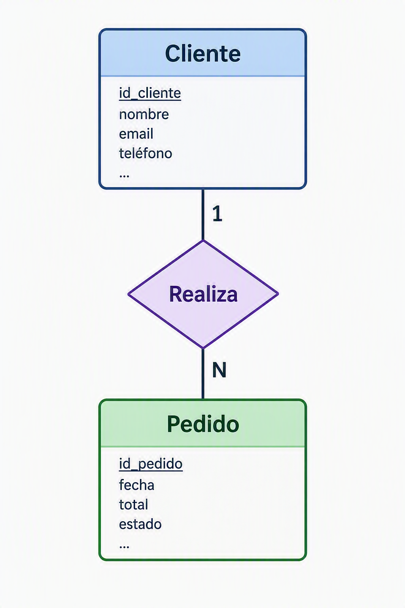
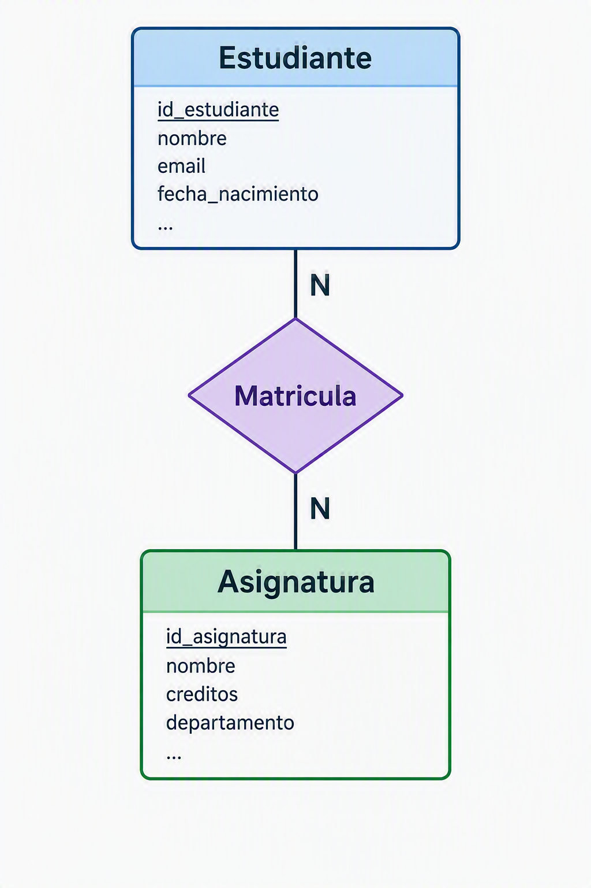

# 2. Bases de datos relacionales

## Introducción

Las bases de datos relacionales constituyen uno de los pilares fundamentales de la informática moderna. Desde aplicaciones web y sistemas empresariales hasta plataformas de comercio electrónico o servicios en la nube, gran parte de la información que utilizamos diariamente se almacena y gestiona mediante este modelo.

El modelo relacional fue propuesto por **Edgar F. Codd en 1970** y revolucionó la forma de almacenar información. Su principal ventaja consiste en organizar los datos en **tablas relacionadas** entre sí, permitiendo mantener la integridad de la información y realizar consultas complejas de manera eficiente.

A diferencia de otros sistemas de almacenamiento, una base de datos relacional no se limita a guardar información. También define las relaciones existentes entre los datos, garantizando que éstos permanezcan consistentes a lo largo del tiempo.

---

## El modelo relacional

El modelo relacional organiza la información en estructuras denominadas relaciones, que habitualmente se representan mediante tablas.

Cada tabla almacena información sobre una entidad concreta del sistema. Por ejemplo, en una aplicación de gestión académica podrían existir tablas para alumnos, profesores, asignaturas y matrículas.

La filosofía del modelo relacional se basa en varios principios:

- La información se almacena en **tablas**.
- Cada tupla (fila) representa un **registro** único.
- Cada **columna** representa un atributo del registro.
- Las **relaciones** entre tablas se establecen **mediante claves**.
- Los datos pueden consultarse utilizando **SQL**.

Gracias a estos principios, es posible diseñar sistemas complejos manteniendo una estructura organizada y fácil de mantener.

---

## Tablas

Las tablas son el elemento básico de una base de datos relacional.

Cada tabla está compuesta por filas y columnas:

- Las filas contienen los registros.
- Las columnas contienen los atributos de cada registro.

Por ejemplo, una tabla de clientes podría tener la siguiente estructura:

| id_cliente | nombre       | ciudad     |
| ---------- | ------------ | ---------- |
| 1          | Ana Pérez    | Vigo       |
| 2          | Carlos López | Pontevedra |
| 3          | Marta Díaz   | Ourense    |

En este caso:

- Cada fila representa un cliente.
- Cada columna almacena una característica del cliente.
- La tabla completa representa la entidad Cliente.

Las tablas deben diseñarse de forma que cada dato se almacene una única vez, evitando duplicidades innecesarias y facilitando el mantenimiento del sistema.

---

## Claves primarias

Una clave primaria (Primary Key o PK) es un campo que identifica de forma única cada registro de una tabla.

No puede existir más de un registro con el mismo valor de clave primaria.

Tampoco puede contener valores nulos.

Por ejemplo:

| id_cliente | nombre       |
| ---------- | ------------ |
| 1          | Ana Pérez    |
| 2          | Carlos López |
| 3          | Marta Díaz   |

En este caso, `id_cliente` es la clave primaria.

Gracias a ella, el sistema puede localizar cualquier registro de forma rápida e inequívoca.

Las claves primarias suelen ser:

- Números enteros autoincrementales.
- UUID (identificadores únicos universales).
- Códigos internos generados por la aplicación.

Aunque algunos datos como el DNI o el correo electrónico podrían ser únicos, en la práctica suele utilizarse un identificador artificial para evitar problemas futuros.

---

## Claves foráneas

Una clave foránea (Foreign Key o FK) es un campo que establece una relación entre dos tablas.

Su función es garantizar que un registro haga referencia a otro existente.

Supongamos las siguientes tablas:

### Clientes

| id_cliente | nombre       |
| ---------- | ------------ |
| 1          | Ana Pérez    |
| 2          | Carlos López |

### Pedidos

| id_pedido | fecha      | id_cliente |
| --------- | ---------- | ---------- |
| 101       | 2026-01-15 | 1          |
| 102       | 2026-01-16 | 2          |

En este caso:

- `id_cliente` es clave primaria en la tabla Clientes.
- `id_cliente` es clave foránea en la tabla Pedidos.

La clave foránea impide que exista un pedido asociado a un cliente inexistente.

Gracias a este mecanismo se mantiene la integridad referencial de la base de datos.

---

## Relaciones

Las relaciones permiten conectar distintas tablas para representar situaciones reales.

### Relación uno a uno (1:1)

Cada registro de una tabla se relaciona con un único registro de otra.

Por ejemplo:

- Persona
- Pasaporte

Una persona posee un único pasaporte y cada pasaporte pertenece a una única persona.

---

### Relación uno a muchos (1:N)

Es la relación más frecuente.

Un registro de la tabla principal puede relacionarse con varios registros de otra tabla.

Por ejemplo:

- Un cliente puede realizar muchos pedidos.
- Cada pedido pertenece a un único cliente.



---

### Relación muchos a muchos (N:M)

Un registro puede relacionarse con varios registros de otra tabla y viceversa.

Por ejemplo:

- Un estudiante cursa varias asignaturas.
- Una asignatura es cursada por varios estudiantes.

Para implementar esta relación se necesita una tabla intermedia.



La tabla de unión suele contener las claves primarias de ambas tablas.

---

## SQL básico

SQL (Structured Query Language) es el lenguaje utilizado para interactuar con bases de datos relacionales.

Permite crear estructuras, insertar datos, modificarlos y consultarlos.

### Crear una tabla

```sql
CREATE TABLE clientes (  
    id_cliente INT PRIMARY KEY,  
    nombre VARCHAR(100),  
    ciudad VARCHAR(50)  
);
```

Esta sentencia crea una tabla llamada `clientes`.

---

### Insertar registros

INSERT INTO clientes  

VALUES (1, 'Ana Pérez', 'Vigo');  

`

También podemos insertar varios registros:

```sql
INSERT INTO clientes VALUES  
(2, 'Carlos López', 'Pontevedra'),
(3, 'Marta Díaz', 'Cañiza')
```

---

### Consultar datos

```sql
#Obtiene todas las filas y columnas.
SELECT * FROM clientes; 

#Consultar únicamente algunos campos:
SELECT nombre, ciudad  
FROM clientes;
```

---

### Filtrar resultados

```sql
SELECT *  
FROM clientes  
WHERE ciudad = 'Vigo';
```

Solo mostrará los clientes de Vigo.

---

### Ordenar resultados

```sql
SELECT *  
FROM clientes  
ORDER BY nombre;
```

Ordena los registros alfabéticamente.

---

### Actualizar datos

```sql
UPDATE clientes  
SET ciudad = 'Madrid'  
WHERE id_cliente = 2;
```

Modifica el valor de un registro existente.

---

### Eliminar registros

```sql
DELETE FROM clientes  
WHERE id_cliente = 1;
```

Elimina el registro seleccionado.

---

## Caso práctico: diseño de una base de datos sencilla

Supongamos una pequeña librería que desea gestionar clientes y pedidos.

### Tabla Clientes

```sql
CREATE TABLE clientes (  
    id_cliente INT PRIMARY KEY,  
    nombre VARCHAR(100),  
    email VARCHAR(255)
);
```

### Tabla Pedidos

```sql
CREATE TABLE pedidos (  
    id_pedido INT PRIMARY KEY,  
    fecha DATE,  
    id_cliente INT
);


ALTER TABLE clientes
    ADD FOREIGN KEY (id_cliente) REFERENCES clientes(id_cliente) 
    ON DELETE RESTRICT ON UPDATE CASCADE;
```

El diseño refleja una relación uno a muchos:

- Un cliente puede realizar muchos pedidos.
- Cada pedido pertenece a un único cliente.

Este modelo puede ampliarse posteriormente añadiendo productos, categorías, proveedores o métodos de pago.

---

## Caso práctico: consultas SQL básicas

### Obtener todos los clientes

```sql
SELECT * FROM clientes;
```

---

### Obtener todos los pedidos

```sql
SELECT * FROM pedidos;
```

---

### Obtener pedidos con información del cliente

```sql
SELECT
p.id_pedido,
p.fecha,
c.nombre
FROM pedidos p
JOIN clientes c
ON p.id_cliente = c.id_cliente
```

El operador `JOIN` permite combinar información de varias tablas relacionadas.

Resultado:

| id_pedido | fecha      | nombre       |
| --------- | ---------- | ------------ |
| 101       | 2026-01-15 | Ana Pérez    |
| 102       | 2026-01-16 | Carlos López |

---

## Ejemplos de sistemas gestores de bases de datos relacionales

### PostgreSQL

PostgreSQL es uno de los **sistemas de bases de datos relacionales más avanzados del mercado**.

Destaca por:

- Software libre y de código abierto.
- Alto cumplimiento de los estándares SQL.
- Excelente rendimiento.
- Soporte para procedimientos almacenados.
- Funciones avanzadas de análisis de datos.

Es muy utilizado en aplicaciones empresariales y servicios web de gran escala.

---

### MySQL

MySQL es probablemente el gestor relacional **más popular en entornos web**.

Sus principales características son:

- Facilidad de uso.
- Amplia comunidad de usuarios.
- Gran integración con PHP y otros lenguajes.
- Buen rendimiento en aplicaciones web.

Muchas aplicaciones basadas en el modelo LAMP utilizan MySQL como motor de base de datos.

---

### SQL Server

SQL Server es el sistema gestor desarrollado por Microsoft.

Entre sus ventajas destacan:

- **Excelente integración con el ecosistema Microsoft**.
- Herramientas gráficas avanzadas.
- Seguridad empresarial.
- Integración con Power BI y Azure.

Es frecuente en grandes organizaciones que trabajan con tecnologías Microsoft.

---

### Oracle Database

Oracle es uno de los gestores de bases de datos empresariales más potentes.

Sus características principales son:

- Alta escalabilidad.
- Elevada disponibilidad.
- Gestión avanzada de grandes volúmenes de datos.
- Amplio uso en banca, telecomunicaciones y administraciones públicas.

Tradicionalmente ha sido la opción elegida para entornos críticos de misión.

---

# Relación con AWS

En entornos cloud, las bases de datos relacionales siguen siendo fundamentales. AWS ofrece servicios administrados que permiten desplegar motores relacionales sin necesidad de gestionar directamente los servidores.

Según la planificación del módulo MP5162, el alumnado trabaja específicamente con **Amazon RDS** y **Amazon Aurora** para administrar bases de datos relacionales en la nube.

## Amazon RDS

Amazon Relational Database Service (RDS) es un servicio administrado que simplifica la creación y administración de bases de datos relacionales.

Con RDS, AWS se encarga de tareas como:

- Instalación del motor de base de datos.
- Copias de seguridad.
- Actualizaciones.
- Monitorización.
- Recuperación ante fallos.

RDS permite utilizar diferentes motores como:

- MySQL
- PostgreSQL
- MariaDB
- Oracle Database
- Microsoft SQL Server

De esta forma, los administradores pueden centrarse en los datos y las aplicaciones en lugar de la gestión de la infraestructura.

---

## Amazon Aurora

Amazon Aurora es una base de datos relacional desarrollada por AWS y compatible con MySQL y PostgreSQL.

Su objetivo es ofrecer:

- Mayor rendimiento.
- Mayor disponibilidad.
- Escalado automático.
- Réplicas de lectura integradas.
- Recuperación rápida ante fallos.

Aurora se considera una evolución de los motores relacionales tradicionales adaptada específicamente para la nube.

Dentro del módulo de administración de bases de datos y almacenamiento en la nube se contempla expresamente la creación y administración de clústeres de Amazon Aurora como una competencia práctica fundamental.

---

## Conclusión

Las bases de datos relacionales continúan siendo la tecnología de referencia para el almacenamiento estructurado de información. El modelo relacional proporciona mecanismos sólidos para representar entidades, establecer relaciones y garantizar la integridad de los datos mediante claves primarias y foráneas. Gracias al lenguaje SQL, es posible manipular y consultar grandes volúmenes de información de forma eficiente.

Aunque los entornos cloud han transformado la infraestructura tecnológica, los principios fundamentales del modelo relacional permanecen inalterados. Servicios como Amazon RDS y Amazon Aurora demuestran cómo las bases de datos relacionales han evolucionado hacia modelos gestionados y altamente escalables, manteniendo la misma filosofía que las ha convertido en una de las tecnologías más importantes de la historia de la informática.
