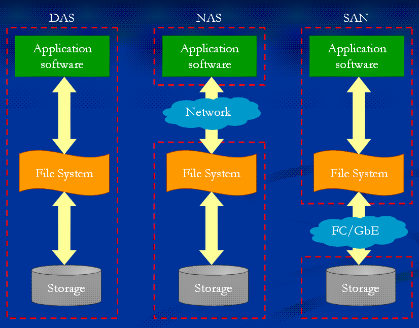
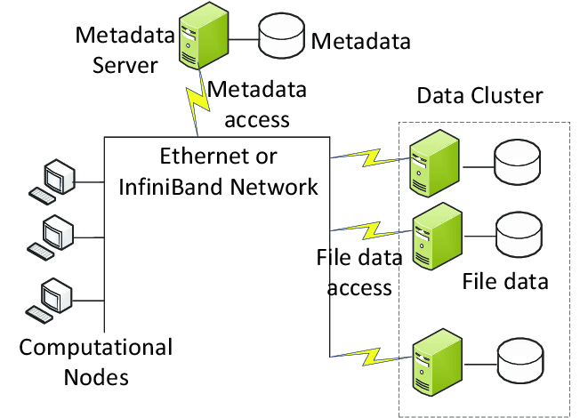

# 1. Introducción al almacenamiento de datos

Desde los primeros sistemas informáticos, el almacenamiento ha constituido uno de los pilares fundamentales de la computación. Toda aplicación, servicio o sistema necesita **conservar información** para poder operar de forma útil y persistente. Sin mecanismos de almacenamiento, los datos desaparecerían al apagar un equipo, limitando enormemente las posibilidades de cualquier sistema informático.

La **evolución** del almacenamiento ha estado estrechamente ligada al crecimiento de las organizaciones y al aumento continuo del volumen de información. A medida que las empresas comenzaron a depender cada vez más de aplicaciones digitales, bases de datos, servicios web y sistemas de comunicación, surgió la necesidad de almacenar mayores cantidades de datos de manera segura, accesible y eficiente.

El almacenamiento moderno no solo debe conservar información. También debe garantizar:

- Disponibilidad

- Integridad

- Protección frente a pérdidas

- Capacidad de crecimiento.

Estas necesidades han impulsado la aparición de diferentes modelos tecnológicos que han evolucionado desde soluciones locales simples hasta complejas infraestructuras distribuidas y servicios completamente gestionados en la nube. La importancia de estos modelos se refleja también en la transición formativa desde los sistemas tradicionales hacia arquitecturas cloud modernas.

---

## 1.1. Evolución histórica del almacenamiento

La historia del almacenamiento puede entenderse como una búsqueda constante de soluciones capaces de gestionar **cantidades crecientes de información con menores costes y mayor disponibilidad**.

En las primeras décadas de la informática, el almacenamiento se encontraba físicamente conectado al propio equipo que generaba o utilizaba los datos. Posteriormente aparecieron soluciones específicas para compartir información a través de la red, permitiendo que varios sistemas accedieran simultáneamente a los mismos recursos. Con el crecimiento de Internet, la virtualización y los centros de datos, surgieron nuevas arquitecturas capaces de distribuir la información entre múltiples servidores y ubicaciones geográficas.

Actualmente, los sistemas de almacenamiento han evolucionado hacia modelos cloud en los que la infraestructura física deja de ser una preocupación para el usuario. Los recursos se consumen como servicios bajo demanda, escalando automáticamente según las necesidades y permitiendo una disponibilidad global de los datos. Esta evolución es precisamente uno de los fundamentos sobre los que se construye la computación en la nube moderna.

---

### 1.1.1. Almacenamiento local

El almacenamiento local representa el modelo más sencillo y tradicional. En este enfoque, los dispositivos de almacenamiento se encuentran **instalados directamente en el equipo que utiliza los datos**.

Durante muchos años, los discos duros mecánicos (HDD) constituyeron la principal tecnología de almacenamiento local. Posteriormente aparecieron las unidades de estado sólido (SSD), capaces de ofrecer velocidades considerablemente superiores gracias a la ausencia de componentes mecánicos.

La principal ventaja de este modelo radica en su simplicidad. Los datos son accesibles directamente por el sistema operativo sin necesidad de utilizar redes o elementos intermedios. Esto proporciona una **baja latencia y un elevado rendimiento para tareas locales**.

Sin embargo, conforme las organizaciones crecieron, el almacenamiento local comenzó a mostrar importantes limitaciones. Cada servidor mantenía su propia **información de forma aislada, dificultando el intercambio de datos, las copias de seguridad centralizadas y la expansión de la capacidad disponible**. Además, una avería en el equipo podía provocar la pérdida o indisponibilidad de la información almacenada.

Estas limitaciones impulsaron la búsqueda de soluciones centralizadas capaces de compartir recursos entre múltiples usuarios y sistemas.

---

### 1.1.2. NAS (Network Attached Storage)

El concepto de NAS, o *Network Attached Storage*, surge como respuesta a la necesidad de compartir archivos entre distintos usuarios a través de una red.

Un dispositivo NAS puede entenderse como un servidor especializado cuyo propósito principal es almacenar y ofrecer archivos a otros equipos. En lugar de guardar la información en los discos de cada ordenador, los datos se almacenan de forma centralizada y se accede a ellos mediante **protocolos de red como SMB, CIFS o NFS**.

Este enfoque simplifica enormemente la administración de la información dentro de una organización. Los usuarios pueden acceder a documentos comunes, compartir recursos y realizar copias de seguridad de manera más sencilla. Además, la ampliación de la capacidad puede realizarse en un único punto centralizado.

Los sistemas NAS se hicieron especialmente populares en pequeñas y medianas empresas debido a su facilidad de despliegue y administración. Sin embargo, están orientados principalmente al almacenamiento de archivos y pueden presentar limitaciones cuando aplicaciones empresariales o bases de datos requieren grandes volúmenes de operaciones de entrada y salida.

La necesidad de ofrecer un rendimiento superior para sistemas críticos llevó al desarrollo de arquitecturas especializadas conocidas como SAN.

---

### 1.1.3. SAN (Storage Area Network)

Una SAN, o *Storage Area Network*, constituye una red dedicada exclusivamente al almacenamiento de datos.

A diferencia de los sistemas NAS, donde los archivos se comparten a través de protocolos de red convencionales, una SAN proporciona acceso directo a bloques de almacenamiento. Desde la perspectiva del servidor, estos bloques **se comportan como si fueran discos locales**, aunque físicamente se encuentren en cabinas de almacenamiento remotas.

Las SAN surgieron para responder a las necesidades de grandes organizaciones, centros de datos y aplicaciones críticas que **requerían elevados niveles de rendimiento**, disponibilidad y escalabilidad. Tecnologías como Fibre Channel o iSCSI permitieron crear infraestructuras de almacenamiento especializadas capaces de soportar bases de datos empresariales, plataformas de virtualización y sistemas de misión crítica.

Este modelo introdujo un importante nivel de **separación entre los servidores y los dispositivos de almacenamiento**. Los recursos podían crecer de forma independiente, mejorando la gestión y optimizando el uso de la infraestructura.

No obstante, las SAN suelen requerir hardware especializado, conocimientos avanzados de administración y costes elevados de implantación y mantenimiento.

En resumen, SAN entrega volúmenes de almacenamiento (LUNs) como discos físicos vacíos a un único servidor, el cual debe formatearlos y, si desea compartirlos, compartirlos en red vía SMB o NFS. 

La única excepción en la que podríamos conectar varios servidores simultáneamente a la misma LUN es utilizar un sistema de archivos en clúster (como VMFS).

---

### 1.1.4. Almacenamiento distribuido

El crecimiento de Internet y de los grandes proveedores de servicios digitales planteó nuevos desafíos. Las arquitecturas tradicionales comenzaron a resultar insuficientes para gestionar **volúmenes masivos de información** y garantizar una **disponibilidad continua a escala global**.

El almacenamiento distribuido surge como una solución basada en la distribución de los datos entre múltiples sistemas físicos. En lugar de depender de un único servidor o cabina de almacenamiento, la información se replica y fragmenta entre numerosos nodos conectados.

Este modelo ofrece importantes ventajas. Si un nodo falla, otros pueden continuar proporcionando acceso a la información. Además, el crecimiento de la capacidad ya no depende de sustituir equipos por otros mayores, sino de **añadir nuevos nodos al sistema** (escalabilidad horizontal).

Conceptos como replicación, tolerancia a fallos, alta disponibilidad y escalabilidad horizontal se convierten en elementos fundamentales de estas arquitecturas. Sistemas como Hadoop HDFS, Ceph o GlusterFS representan ejemplos destacados de almacenamiento distribuido.

Las bases tecnológicas desarrolladas en este ámbito constituyen el fundamento de muchas de las plataformas cloud actuales.

---

### 1.1.5. Cloud Storage

El almacenamiento en la nube representa la evolución natural de las arquitecturas distribuidas. En este modelo, los recursos de almacenamiento son **ofrecidos como un servicio por proveedores especializados**, eliminando para las organizaciones la necesidad de gestionar directamente la infraestructura física. Este cambio forma parte de la transición desde los modelos tradicionales hacia infraestructuras y servicios cloud modernos.

El usuario no necesita conocer la ubicación exacta de los discos ni los servidores que almacenan los datos. Simplemente consume capacidad bajo demanda mediante interfaces web, APIs o herramientas de administración proporcionadas por el proveedor.

Los servicios actuales de almacenamiento cloud suelen clasificarse en tres grandes categorías:

- Almacenamiento de objetos.
- Almacenamiento de bloques.
- Almacenamiento de archivos.

La principal característica de este modelo es la abstracción de la infraestructura. Los proveedores se encargan de aspectos como la redundancia, la replicación geográfica, la seguridad física, el mantenimiento y la ampliación de capacidad.

Además, el almacenamiento cloud permite adoptar modelos de pago por uso, ajustando los costes al consumo real de recursos. Esto proporciona una gran flexibilidad para organizaciones de cualquier tamaño y facilita la creación de servicios distribuidos a escala global.

Actualmente, plataformas como AWS, Microsoft Azure o Google Cloud constituyen la referencia en este ámbito, ofreciendo servicios capaces de almacenar desde pequeños ficheros hasta enormes volúmenes de datos utilizados en analítica, inteligencia artificial y aplicaciones empresariales de alcance mundial.

---

### 1.1.6. Tendencias actuales

El almacenamiento continúa evolucionando hacia modelos cada vez más automatizados, distribuidos y orientados al servicio. Las organizaciones demandan infraestructuras capaces de crecer dinámicamente, integrarse con aplicaciones nativas de nube y proporcionar altos niveles de disponibilidad sin incrementar la complejidad administrativa.

En este contexto, conceptos como almacenamiento híbrido, multinube, almacenamiento definido por software y servicios gestionados se han convertido en elementos clave de las arquitecturas modernas. El objetivo ya no consiste únicamente en conservar información, sino en facilitar su acceso, análisis y explotación de forma segura, eficiente y escalable.

Como resultado, el almacenamiento ha pasado de ser un simple componente hardware a convertirse en una de las capas estratégicas más importantes de cualquier infraestructura tecnológica actual.

## 1.2. Conceptos básicos del almacenamiento

Para diseñar, administrar o seleccionar una solución de almacenamiento es necesario comprender una serie de conceptos fundamentales que determinan su comportamiento y calidad de servicio. Estos parámetros permiten evaluar si una tecnología de almacenamiento es adecuada para un determinado entorno, ya sea un servidor local, una cabina SAN, un sistema distribuido o una plataforma cloud.

En la actualidad, los proveedores de servicios en la nube ofrecen múltiples opciones de almacenamiento que pueden diferenciarse precisamente por aspectos como la capacidad, el rendimiento, la latencia, la durabilidad o la disponibilidad. Estos criterios son utilizados habitualmente para dimensionar infraestructuras y seleccionar la solución más adecuada para cada caso de uso.

---

### 1.2.1. Capacidad

La capacidad representa la cantidad máxima de información que un sistema de almacenamiento puede conservar. Tradicionalmente se mide en bytes y sus múltiplos, siendo habituales unidades como gigabytes (GB), terabytes (TB) o petabytes (PB).

Durante muchos años, la capacidad fue uno de los principales criterios de selección de un sistema de almacenamiento. Las organizaciones buscaban disponer de suficiente espacio para albergar sistemas operativos, aplicaciones, documentos y bases de datos. Sin embargo, el crecimiento constante del volumen de información ha convertido la capacidad en un requisito estratégico.

La necesidad de almacenar grandes cantidades de datos se ha visto impulsada por la digitalización de procesos empresariales, el comercio electrónico, los servicios multimedia, el Internet de las Cosas (IoT) y los sistemas de análisis masivo de datos. En consecuencia, los entornos modernos deben ser capaces de **ampliar su capacidad de forma flexible** sin interrumpir el servicio.

En los sistemas tradicionales, aumentar la capacidad implicaba instalar nuevos discos o sustituir los existentes por otros de mayor tamaño. En los entornos cloud, por el contrario, la capacidad puede ampliarse dinámicamente mediante el aprovisionamiento de nuevos recursos, permitiendo una escalabilidad prácticamente ilimitada. Esta capacidad de crecer bajo demanda constituye una de las principales ventajas de las arquitecturas modernas de almacenamiento.

---

### 1.2.2. Rendimiento: IOPS y Throughput

Aunque la capacidad determina cuánto puede almacenarse, no indica la velocidad con la que los datos pueden ser leídos o escritos. Para ello se utiliza el concepto de rendimiento.

El rendimiento de un sistema de almacenamiento puede analizarse desde dos perspectivas complementarias: las operaciones de entrada y salida por segundo (IOPS) y el caudal o ancho de banda de transferencia (*throughput*).

#### IOPS (Input/Output Operations Per Second)

Las IOPS miden el número de **operaciones de lectura y escritura que puede realizar un sistema en un segundo**.

Este indicador resulta especialmente **importante en aplicaciones que realizan un gran número de accesos pequeños y frecuentes a los datos**. Bases de datos transaccionales, servidores de correo electrónico o sistemas de virtualización suelen depender en gran medida de este parámetro.

Cuantas más IOPS pueda proporcionar un sistema, mayor será su capacidad para responder a múltiples solicitudes simultáneas. Un disco SSD moderno puede ofrecer decenas de miles de IOPS, mientras que un disco mecánico tradicional presenta valores significativamente inferiores.

#### Throughput

El throughput representa la **cantidad total de datos que puede transferirse por unidad de tiempo**, normalmente expresada en MB/s o GB/s.

Este parámetro es especialmente relevante en operaciones de transferencia masiva de datos, como copias de seguridad, procesamiento multimedia o análisis de grandes volúmenes de información.

Mientras que las IOPS se centran en el número de operaciones realizadas, el throughput mide la cantidad de información transportada. Ambos parámetros son importantes y deben evaluarse conjuntamente, ya que una solución puede ofrecer muchas IOPS para archivos pequeños y, sin embargo, presentar un throughput limitado para transferencias de gran tamaño.

En los entornos cloud modernos, muchos servicios permiten seleccionar diferentes niveles de rendimiento en función de las necesidades de cada carga de trabajo, equilibrando rendimiento y coste.

---

### 1.2.3. Latencia

La latencia es el **tiempo que transcurre desde que un sistema solicita el acceso a un dato hasta que comienza a recibir una respuesta**.

Puede entenderse como el tiempo de espera asociado a cada operación de lectura o escritura. Cuanto menor sea la latencia, mayor será la sensación de rapidez del sistema.

Un ejemplo sencillo es el acceso a una base de datos. Aunque un sistema pueda transferir grandes cantidades de información por segundo, si cada consulta requiere varios milisegundos para comenzar a ejecutarse, el rendimiento percibido por las aplicaciones se verá afectado.

La latencia depende de numerosos factores:

- La tecnología utilizada por los dispositivos de almacenamiento.
- La distancia física entre cliente y servidor.
- La carga de trabajo existente.
- La infraestructura de red.
- Los mecanismos de seguridad o cifrado aplicados.

**En entornos distribuidos y cloud, la ubicación geográfica adquiere especial relevancia**. Por este motivo, los proveedores de nube permiten desplegar recursos en distintas regiones y zonas de disponibilidad para reducir los tiempos de acceso y mejorar la experiencia de los usuarios. La selección de regiones, zonas y mecanismos de replicación forma parte de los criterios habituales de diseño de almacenamiento en la nube.

---

### 1.2.4. Durabilidad

La durabilidad mide la **probabilidad de que los datos permanezcan íntegros y recuperables a lo largo del tiempo**.

En otras palabras, indica la capacidad de un sistema para evitar la pérdida permanente de información.

La durabilidad se convierte en un factor crítico cuando se almacenan datos de valor elevado, como información financiera, documentación legal, registros sanitarios o copias de seguridad corporativas.

Para incrementar la durabilidad se emplean diferentes mecanismos:

- Replicación de datos.
- Sistemas [RAID](https://es.wikipedia.org/wiki/RAID).
- Verificación de integridad.
- Copias de seguridad.
- Distribución geográfica de la información.

En los servicios cloud actuales, la durabilidad suele conseguirse mediante el almacenamiento simultáneo de múltiples copias de los datos en diferentes dispositivos e incluso en distintas ubicaciones físicas. De este modo, aunque se produzca una avería de hardware o un incidente local, la información continúa estando disponible y protegida. Los sistemas de almacenamiento en nube incorporan habitualmente mecanismos de replicación y copia de seguridad para garantizar la recuperación de la información cuando sea necesario.

---

### 1.2.5. Disponibilidad

La disponibilidad expresa la **capacidad de un servicio para permanecer accesible cuando los usuarios o aplicaciones lo necesitan**.

Mientras que la durabilidad se centra en evitar la pérdida de datos, la disponibilidad se refiere a la posibilidad de acceder a ellos de forma continua.

Este concepto suele expresarse mediante **porcentajes**. Por ejemplo, una disponibilidad del 99,9 % implica que el servicio podrá experimentar únicamente breves interrupciones a lo largo del año.

La disponibilidad depende de numerosos elementos:

- La fiabilidad del hardware.
- La redundancia de componentes.
- La existencia de copias de respaldo.
- Los sistemas de monitorización.
- Los mecanismos automáticos de recuperación.

En los entornos modernos es habitual diseñar infraestructuras de alta disponibilidad utilizando múltiples servidores, redes redundantes y sistemas de almacenamiento replicados. El propio currículo del curso destaca la importancia de la disponibilidad como uno de los criterios fundamentales para el diseño de infraestructuras cloud, redes y servicios de almacenamiento.

---

### 1.2.6. Replicación

La replicación consiste en **mantener varias copias sincronizadas de los mismos datos en diferentes dispositivos, servidores o ubicaciones geográficas**.

Su principal objetivo es incrementar la disponibilidad, la tolerancia a fallos y la durabilidad de la información.

Cuando una copia deja de estar disponible debido a una incidencia, otra réplica puede asumir su función sin afectar significativamente al servicio. Este mecanismo constituye uno de los fundamentos del almacenamiento distribuido y de la computación en la nube.

Existen diferentes modalidades de replicación:

#### Replicación local

Las copias se almacenan dentro de la misma instalación o centro de datos. Proporciona protección frente a fallos de hardware individuales, aunque no frente a desastres que afecten a toda la ubicación.

#### Replicación geográfica

Las copias se distribuyen entre diferentes centros de datos o regiones geográficas.

Este modelo ofrece una protección mucho mayor frente a incidencias de gran alcance y es ampliamente utilizado por los grandes proveedores cloud.

#### Replicación síncrona y asíncrona

En la replicación **síncrona, los cambios deben confirmarse en todas las copias antes de completarse la operación***. Esto garantiza una **consistencia muy elevada**.

En la replicación **asíncrona, los cambios se propagan posteriormente a las réplicas**. Este enfoque suele proporcionar un **mejor rendimiento**, aunque puede existir un pequeño desfase temporal entre las distintas copias.

La replicación es uno de los pilares sobre los que se construyen los servicios modernos de almacenamiento. Gracias a ella es posible garantizar elevados niveles de disponibilidad, recuperación ante fallos y protección frente a la pérdida de datos, características esenciales en cualquier infraestructura cloud actual. El currículo oficial incluye de forma reiterada la replicación como requisito clave en sistemas de almacenamiento, bases de datos, análisis de datos y arquitecturas resilientes.
